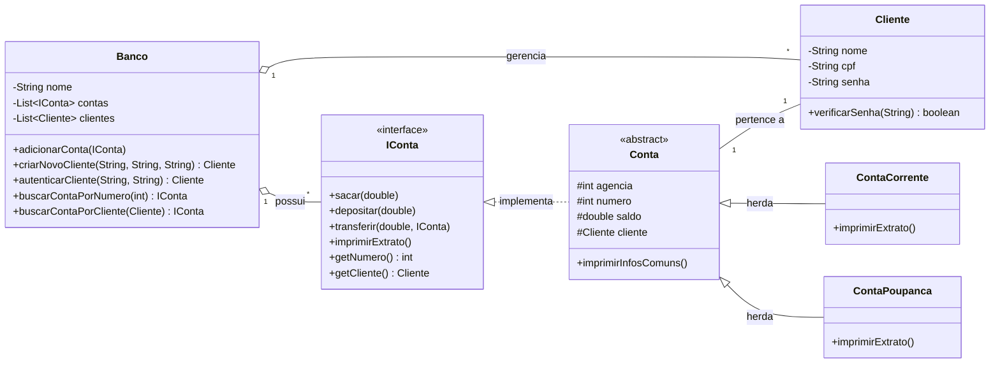

# Banco Digital com Java - Desafio de POO


## 📝 Descrição do Projeto

Este projeto é uma implementação de um sistema de banco digital simples, desenvolvido como solução para o **Desafio de Projeto sobre Programação Orientada a Objetos** da [Digital Innovation One](https://www.dio.me/). A aplicação simula, via console, as operações bancárias essenciais, como criação de contas, login de clientes, saques, depósitos, transferências e extratos, aplicando os quatro pilares da POO.

## ✨ Funcionalidades

- **Gerenciamento de Clientes:**
  - Criação de novos clientes com nome, CPF e senha.
  - Autenticação de clientes existentes através de CPF e senha.
- **Sistema de Contas:**
  - Abertura de Conta Corrente e Conta Poupança.
  - Geração automática de agência e número de conta sequencial.
- **Operações Bancárias:**
  - Realização de saques, depósitos e transferências entre contas.
  - Validação de saldo para operações de saque e transferência.
- **Consultas:**
  - Impressão de extrato detalhado da conta.
- **Simulação de Investimentos:**
  - Funcionalidade básica para simular a aplicação em produtos de investimento.
- **Interface Interativa:**
  - Menu dinâmico que se adapta ao estado do usuário (logado ou deslogado).
  - Data e hora de acesso atualizadas dinamicamente.

## 🏛️ Design e Arquitetura

A arquitetura do projeto foi baseada nos princípios fundamentais da Programação Orientada a Objetos para garantir um código limpo, coeso e extensível:

- **Interface `IConta`:** Define o "contrato" com as operações que toda conta deve ter, permitindo o uso de polimorfismo.
- **Classe Abstrata `Conta`:** Reutiliza código comum a todos os tipos de conta (atributos como agência, número, saldo e implementações de métodos como `sacar` e `depositar`).
- **Herança:** As classes `ContaCorrente` e `ContaPoupanca` herdam da classe `Conta`.
- **Composição:** A classe `Banco` *tem uma* lista de Contas e Clientes, e uma `Conta` *tem um* `Cliente`.
- **Separação de Responsabilidades:** O projeto é dividido em pacotes (`model`, `service`) para organizar as classes por suas responsabilidades.

## 📊 Diagrama UML (Mermaid)



## 🛠️ Tecnologias Utilizadas

- **Java 17**
- **Java Collections Framework** (`List`, `ArrayList`)
- **API `java.time`** (para data dinâmica)

## ▶️ Como Executar

1.  **Pré-requisitos:** Ter o Java JDK (versão 11 ou superior) instalado e configurado.
2.  **Clone o repositório:** `git clone [URL-DO-SEU-REPOSITORIO]`
3.  **Navegue até a pasta `src`** do projeto via terminal.
4.  **Compile todos os arquivos:**
    ```bash
    javac Main.java
    ```
5.  **Execute a aplicação:**
    ```bash
    java Main
    ```
---
